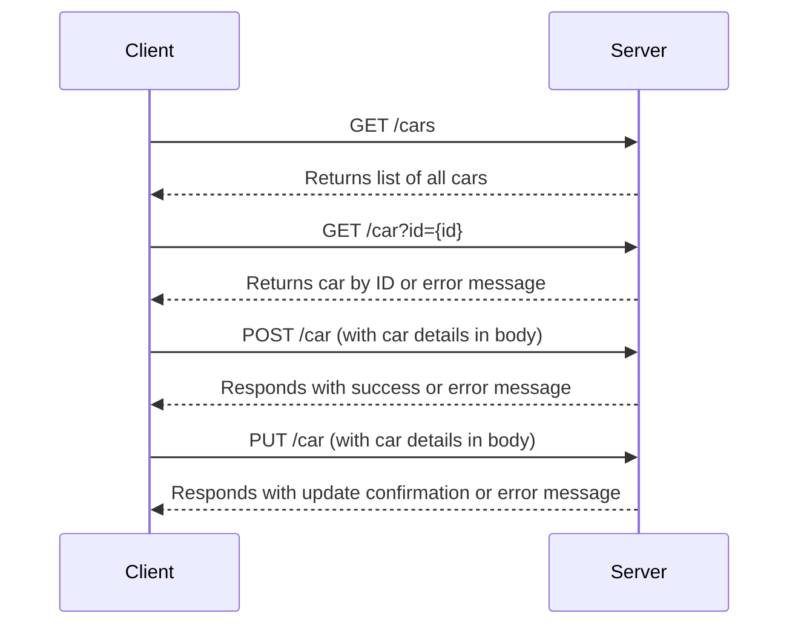
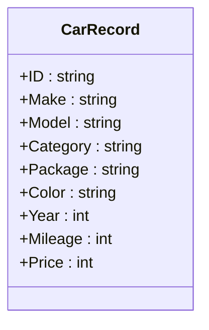

# Sample Cars API Overview

The Cars API is designed to manage and retrieve information about cars. It provides capabilities to add new cars, retrieve specific cars by their ID, list all cars, and update existing car records.

## Endpoints:
* GET /cars: List all the cars in the database.
* GET /car?id={id}: Retrieve details of a specific car by its ID.
* POST /car: Add a new car to the database.
* PUT /car: Update details of an existing car.



## Data Model:


API will not save data past its lifetime.

## Development:

To run:

``` bash
go run ./app
```

To test:

``` bash
go test ./...
```

To run integration tests:

```bash
go run ./app &
go test -tags=integration
```
