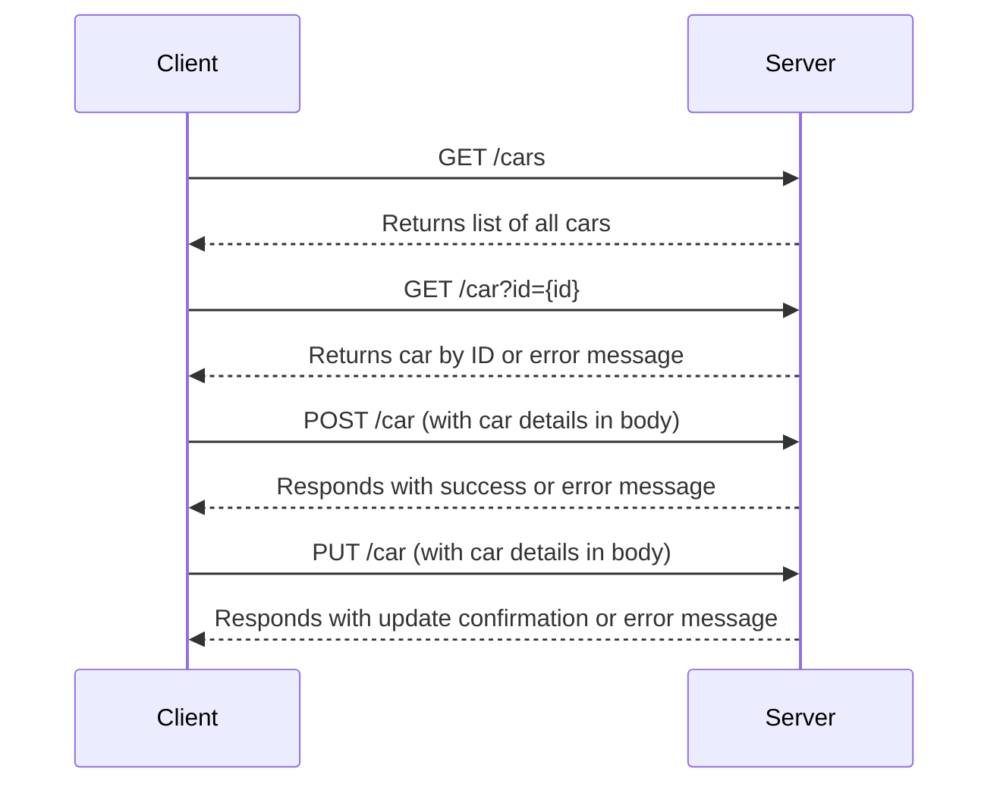
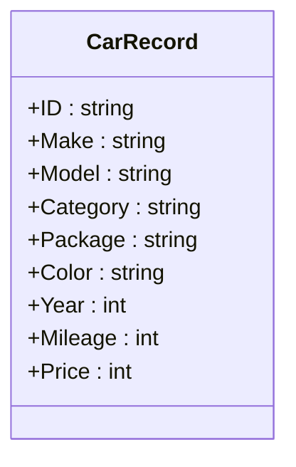

# Sample Cars API Overview

The Cars API is designed to manage and retrieve information about cars. It provides capabilities to add new cars, retrieve specific cars by their ID, list all cars, and update existing car records.

## Endpoints:

* GET /cars: List all the cars in the database.
* GET /car?id={id}: Retrieve details of a specific car by its ID.
* POST /car: Add a new car to the database.
* PUT /car: Update details of an existing car.



## Data Model:



API will not save data past its lifetime.

## Development:

To run:

```bash
go run ./app
```

To test:

```bash
go test ./...
```

To run integration tests:

```bash
go run ./app &
INTEGRATION=1 go test ./tests

```

A docker container with the image can be used to run the api. Image should weigh about 7.3MB

```bash
docker build -t api:test .
```

Then to run it:

```bash
docker run -it --rm -p 8080:8080 api:test
```

And then run in another terminal:

```bash
INTEGRATION=1 go test -count=1 ./tests
```

Example Server output from tests:

```json
{"time":"2023-08-16T21:37:17.739972853Z","level":"INFO","msg":"Starting server","Address":":8080"}
{"time":"2023-08-16T21:37:28.903381965Z","level":"INFO","msg":"added new car with id: 'test-car-1'"}
{"time":"2023-08-16T21:37:28.90414377Z","level":"INFO","msg":"listing all 1 cars"}
{"time":"2023-08-16T21:37:28.904557278Z","level":"INFO","msg":"found car with id: 'test-car-1'"}
{"time":"2023-08-16T21:37:28.904890548Z","level":"INFO","msg":"updated car with id: 'test-car-1'"}
```

## TODOS:

- Improve documentation and diagrams
- Improve unit-tests cases
- Add CICD pipeline to run unit-tests & integration-tests on push to branch.
- Implement data persistent storage